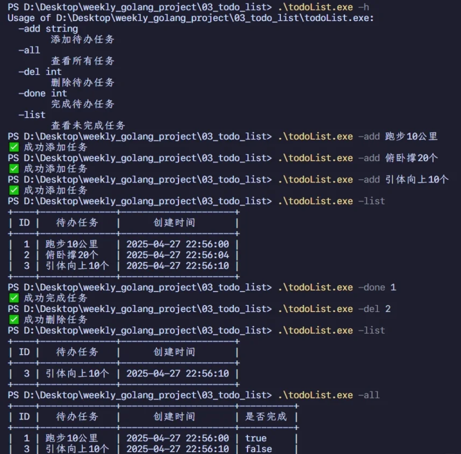

# 测试

```bash
go build -o todoList.exe .\main.go
```




---

# cmd命令行便捷使用


你的命令行工具项目已经具备了任务管理的基本功能，为了让其更方便使用，可以通过以下步骤进行部署和优化：

---

### **一、编译生成可执行文件**
使用 `go build` 命令生成可执行文件，建议通过 `-o` 参数自定义名称：
```bash
go build -o todo  # 生成名为 todo（Linux/Mac）或 todo.exe（Windows）
```

---

### **二、将可执行文件加入系统路径**
#### **1. 方法一：直接移动文件**
- **Linux/Mac**：将可执行文件复制到 `/usr/local/bin`：
  ```bash
  sudo cp todo /usr/local/bin/
  ```
- **Windows**：将文件放入系统路径（如 `C:\Windows\system32`）。

#### **2. 方法二：添加当前目录到 PATH**
- **Linux/Mac**：在 `~/.bashrc` 或 `~/.zshrc` 中添加：
  ```bash
  export PATH=$PATH:/path/to/your/project
  ```
- **Windows**：通过系统属性 > 环境变量 > 编辑 PATH，添加项目目录。

**完成后，可在任意终端直接运行 `todo` 命令**。

---

### **三、优化命令别名（可选）**
若需更简短的命令名（如 `td`），可创建软链接：
```bash
# Linux/Mac
ln -s /path/to/todo /usr/local/bin/td

# Windows（以管理员身份运行 cmd）
mklink C:\Windows\system32\td.exe C:\path\to\todo.exe
```

---

### **四、验证安装效果**
```bash
todo -add "学习Go语言"   # 添加任务
todo -list              # 查看未完成任务
todo -all               # 查看所有任务
```

---

### **五、进阶部署方案**
#### **1. 跨平台编译**
为不同系统生成可执行文件：
```bash
# Windows
GOOS=windows GOARCH=amd64 go build -o todo.exe

# Linux
GOOS=linux GOARCH=amd64 go build -o todo

# Mac
GOOS=darwin GOARCH=arm64 go build -o todo
```

#### **2. 发布到包管理器**
- **Mac**：通过 Homebrew 发布自定义 Formula。
- **Linux**：打包为 `.deb` 或 `.rpm`。
- **Windows**：使用 Scoop 创建 Manifest 文件。

---

### **六、代码优化建议**
1. **修复潜在拼写错误**：  
   检查 `printTask` 函数中 `v[3] == "false"` 是否正确（当前代码无误，但需注意逻辑）。
2. **增强健壮性**：  
   在 `doneTask` 和 `deleteTask` 中添加 ID 越界检查，例如：
   ```go
   if doneTaskID <= 0 || doneTaskID > len(list) {
       fmt.Println("error: 任务ID无效")
       return
   }
   ```

---

### **七、使用示例**
```bash
# 添加任务
todo -add "阅读文档"
todo -add "编写测试用例"

# 标记任务完成
todo -done 1

# 删除任务
todo -del 2

# 查看未完成任务
todo -list

# 查看所有任务（包括已完成/删除）
todo -all
```

---

通过上述步骤，你的工具可以像系统命令一样全局调用。


---

# 项目详情

```go
var addTaskTitle string // 添加任务的内容
var doneTaskID int      // 完成任务的ID
var deleteTaskID int    // 删除任务的ID
var islistTask bool     // 是否查看未完成任务
var islistAllTask bool  // 是否查看所有任务

func init() {
	flag.StringVar(&addTaskTitle, "add", "", "添加代办任务")
	flag.IntVar(&doneTaskID, "done", 0, "完成待办任务")
	flag.IntVar(&deleteTaskID, "del", 0, "删除待办任务")
	flag.BoolVar(&islistTask, "list", false, "查看未完成任务")
	flag.BoolVar(&islistAllTask, "all", false, "查看所有任务")
	flag.Parse()

}
```

这段代码使用了Go语言标准库中的`flag`包，用于构建一个命令行任务管理工具。以下是逐行解释：

---

### **变量定义**
```go
var addTaskTitle string  // 存储通过 -add 参数传递的任务内容
var doneTaskID int       // 存储通过 -done 参数传递的待完成任务ID
var deleteTaskID int     // 存储通过 -del 参数传递的待删除任务ID
var islistTask bool      // 标记是否启用 -list 参数（查看未完成任务）
var islistAllTask bool   // 标记是否启用 -all 参数（查看所有任务）
```
- 这些变量用于接收命令行参数的值。
- `string`类型适用于任务内容，`int`类型用于任务ID，`bool`类型用于开关类标志。

---

### **初始化函数 `init()`**
```go
func init() {
  flag.StringVar(&addTaskTitle, "add", "", "添加代办任务")
  flag.IntVar(&doneTaskID, "done", 0, "完成待办任务")
  flag.IntVar(&deleteTaskID, "del", 0, "删除待办任务")
  flag.BoolVar(&islistTask, "list", false, "查看未完成任务")
  flag.BoolVar(&islistAllTask, "all", false, "查看所有任务")
  flag.Parse()
}
```

#### **关键点解析**
1. **参数绑定**
    - `flag.StringVar`：将命令行参数 `-add` 的值绑定到变量 `addTaskTitle`，默认值为空字符串，帮助信息为"添加代办任务"。
    - `flag.IntVar`：将 `-done` 和 `-del` 参数的值绑定到 `doneTaskID` 和 `deleteTaskID`，默认值为0。
    - `flag.BoolVar`：将 `-list` 和 `-all` 标记的存在性绑定到布尔变量，默认值为 `false`（未指定参数时为`false`，指定时自动设为`true`）。

2. **参数解析**
    - `flag.Parse()`：解析命令行参数并填充绑定的变量。必须在所有 `flag.*Var` 调用之后执行。

---

### **使用场景示例**
1. **添加任务**
   ```bash
   ./program -add "购买牛奶"
   ```
    - `addTaskTitle` 将被赋值为 `"购买牛奶"`。

2. **完成任务**
   ```bash
   ./program -done 3
   ```
    - `doneTaskID` 被赋值为 `3`。

3. **查看未完成任务**
   ```bash
   ./program -list
   ```
    - `islistTask` 自动设为 `true`，触发对应逻辑。

4. **查看帮助**
   ```bash
   ./program -h
   ```
    - 输出帮助信息（自动生成，包含所有注册参数的说明）。

---

### **设计特点**
1. **默认值机制**
    - 若未指定参数（如 `-add` 未使用），变量保持默认值（如空字符串或0）。

2. **互斥操作**
    - 通过不同的参数（`-add`/`-done`/`-list`）区分功能，程序需在后续逻辑中检查这些变量的值以执行相应操作。

3. **布尔参数的特殊性**
    - `-list` 和 `-all` 只需在命令行中出现即可启用，无需附加值（如 `-list=true`）。

---

### **扩展说明**
- **错误处理**：若用户传递无效参数（如给 `-done` 传递非数字值），`flag.Parse()` 会报错并退出。
- **非标志参数**：可通过 `flag.Args()` 获取未绑定到标志的参数（如 `./program 文件.txt` 中的 `文件.txt`）。

通过这段代码，开发者可以快速构建一个支持增删改查功能的命令行任务管理器，利用 `flag` 包简化参数解析流程。


---


```go
// 加载json文件数据
func loadData() (todoList, error) {
	var list todoList
	// 以只读的方式打开文件 如果不存在则创建 权限0777
	dataFile, err := os.OpenFile(TASKS_FILE_NAME, os.O_RDONLY|os.O_CREATE, os.ModePerm)
	if err != nil {
		return list, fmt.Errorf("打开文件失败:%s", err)
	}

	defer dataFile.Close()
	// 读取文件数据
	data, err := io.ReadAll(dataFile)
	if err != nil {
		return list, fmt.Errorf("读取文件失败:%s", err)
	}
	// 解析json数据
	if len(data) != 0 {
		err = json.Unmarshal(data, &list)
		if err != nil {
			return list, fmt.Errorf("解析json数据失败:%s", err)
		}
	}
	return list, nil

}

// 保存数据到json文件
func saveData(list todoList) error {
	// 以只读的方式打开文件 打开时清空文件 如果不存在则创建 权限0777
	dataFile, err := os.OpenFile(TASKS_FILE_NAME, os.O_CREATE|os.O_RDWR|os.O_TRUNC, os.ModePerm)
	if err != nil {
		return fmt.Errorf("打开文件失败:%s", err)
	}
	defer dataFile.Close()

	// 将任务列表转换为json数据
	data, err := json.Marshal(list)
	if err != nil {
		return fmt.Errorf("转换json数据失败:%s", err)
	}
	// 将json数据写入文件
	_, err = dataFile.Write(data)
	if err != nil {
		return fmt.Errorf("写入文件失败:%s", err)
	}

	return nil
}
```

这段代码实现了Go语言中JSON文件的读取和写入功能，用于任务列表（`todoList`）的持久化存储。以下分两部分详细解析：

---

### **一、加载JSON数据（`loadData`函数）**
```go
func loadData() (todoList, error) {
    var list todoList
    dataFile, err := os.OpenFile(TASKS_FILE_NAME, os.O_RDONLY|os.O_CREATE, os.ModePerm)
    if err != nil {
        return list, fmt.Errorf("打开文件失败:%s", err)
    }
    defer dataFile.Close()

    data, err := io.ReadAll(dataFile)
    if err != nil {
        return list, fmt.Errorf("读取文件失败:%s", err)
    }

    if len(data) != 0 {
        err = json.Unmarshal(data, &list)
        if err != nil {
            return list, fmt.Errorf("解析json数据失败:%s", err)
        }
    }
    return list, nil
}
```

#### **关键步骤解析**
1. **文件打开方式**
   - 使用 `os.OpenFile` 打开文件，标志位 `os.O_RDONLY|os.O_CREATE` 表示：
      - `os.O_RDONLY`：以只读模式打开文件。
      - `os.O_CREATE`：若文件不存在则创建。
   - 权限 `os.ModePerm`（等价于 `0777`），但实际权限可能受系统 `umask` 影响。

2. **读取文件内容**
   - `io.ReadAll(dataFile)` 一次性读取文件全部内容到字节切片 `data`。

3. **JSON解析**
   - 仅当文件内容非空时，调用 `json.Unmarshal(data, &list)` 将 JSON 数据解析到 `todoList` 结构体：
      - `&list` 传递指针，确保解析结果能写入变量。
      - 若解析失败（如 JSON 格式错误），返回自定义错误。

---

### **二、保存数据到JSON文件（`saveData`函数）**
```go
func saveData(list todoList) error {
    dataFile, err := os.OpenFile(TASKS_FILE_NAME, os.O_CREATE|os.O_RDWR|os.O_TRUNC, os.ModePerm)
    if err != nil {
        return fmt.Errorf("打开文件失败:%s", err)
    }
    defer dataFile.Close()

    data, err := json.Marshal(list)
    if err != nil {
        return fmt.Errorf("转换json数据失败:%s", err)
    }

    _, err = dataFile.Write(data)
    if err != nil {
        return fmt.Errorf("写入文件失败:%s", err)
    }
    return nil
}
```

#### **关键步骤解析**
1. **文件打开方式**
   - 标志位 `os.O_CREATE|os.O_RDWR|os.O_TRUNC` 表示：
      - `os.O_CREATE`：文件不存在则创建。
      - `os.O_RDWR`：以读写模式打开文件。
      - `os.O_TRUNC`：打开时清空文件内容（避免旧数据残留）。

2. **JSON编码**
   - `json.Marshal(list)` 将 `todoList` 结构体序列化为 JSON 字节数据。
   - 若编码失败（如包含不可序列化类型），返回错误。

3. **写入文件**
   - `dataFile.Write(data)` 将 JSON 字节数据写入文件。
   - 写入后文件指针自动移动，无需手动调整。

---

### **三、代码设计特点**
1. **错误处理**
   - 每个步骤均检查错误，并返回包含操作上下文的错误信息，便于调试。

2. **文件权限**
   - 使用 `os.ModePerm`（0777）赋予最大权限，但实际权限可能被系统 `umask` 限制（如最终为 0755）。

3. **JSON空文件处理**
   - `loadData` 中若文件为空（如首次运行），直接返回空 `todoList`，避免解析错误。

---

### **四、应用场景**
此代码适用于需要持久化任务列表的场景，例如：
- **待办事项应用**：启动时加载历史任务，退出时保存当前状态。
- **配置管理**：将配置存储在 JSON 文件中，运行时动态加载。

---

### **注意事项**
- **并发安全**：若多协程同时读写文件，需加锁（如 `sync.Mutex`）避免数据竞争。
- **大文件优化**：对于大型 JSON 数据，建议使用流式处理（`json.Decoder`/`json.Encoder`）减少内存占用。
- **权限安全**：生产环境中建议使用更严格的权限（如 `0644`）替代 `0777`。

通过此实现，可以高效完成 JSON 数据的持久化操作，符合 Go 语言简洁高效的设计理念。

---


```go
// 完成任务
func doneTask(list todoList) {
	task := &list[doneTaskID-1]
	task.IsDone = true
	err := saveData(list)
	if err != nil {
		fmt.Println("error: %s\n", err)
	} else {
		fmt.Println("success 成功删除任务")
	}

}
```

在Go语言中，切片作为引用类型的底层实现需要结合具体操作场景来理解。对于你代码中`doneTask`函数内`&list[deleteTaskID-1]`的使用，其背后的原理可以通过以下四点说明：

---

### **1. 切片的值传递本质**
虽然切片是引用类型（底层包含指向数组的指针、长度和容量），但当切片作为参数传递时，Go采用的是**值传递**方式。这会导致函数内部的切片变量是一个副本，但该副本仍然指向相同的底层数组。

- **关键区别**：
    - 直接修改副本切片中的元素（如`list[i].IsDone = true`）会影响原切片，因为底层数组共享
    - 但若对切片本身进行扩容（如`append`操作），副本切片的长度/容量修改不会影响原切片

---

### **2. 结构体值的拷贝问题**
代码中`todoTask`是结构体类型，当通过索引访问切片元素`list[deleteTaskID-1]`时，返回的是该结构体的**值拷贝**：
```go
// 错误用法：修改的是拷贝副本
task := list[doneTaskID-1]
task.IsDone = true  // 不影响原切片
```
此时修改的是结构体的拷贝，原切片中的结构体字段不会改变。

---

### **3. 指针操作的必要性**
通过`&`获取切片元素的地址，实际上是在操作底层数组中**原始结构体的内存地址**：
```go
// 正确用法：通过指针修改原数据
task := &list[doneTaskID-1]
task.IsDone = true  // 直接修改底层数组中的结构体
```
此时通过指针直接修改原结构体的`IsDone`字段，无需依赖切片传递特性。

---

### **4. 与JSON序列化的关联**
在`saveData`函数中，`json.Marshal`操作会重新读取切片中的结构体值。若未通过指针修改原始结构体，则序列化时无法捕获字段变更，导致文件存储的仍是旧数据。

---

### **实验验证**
你可以通过以下代码片段验证两种操作的区别：
```go
type Test struct{ Val int }

func main() {
    list := []Test{{Val: 1}, {Val: 2}}
    
    // 方式1：值拷贝（失败）
    t1 := list[0]
    t1.Val = 100
    fmt.Println(list) // 输出: [{1} {2}]

    // 方式2：指针操作（成功）
    t2 := &list[1]
    t2.Val = 200
    fmt.Println(list) // 输出: [{1} {200}]
}
```

---

### **总结**
| **操作类型**       | **是否需要`&`** | **底层影响**                 |
|--------------------|----------------|----------------------------|
| 修改结构体字段      | 必须使用       | 直接影响底层数组中的原始数据 |
| 修改切片长度/容量   | 不需要         | 仅影响副本切片              |
| 修改基础类型元素    | 不需要         | 直接影响底层数组            |

在你的场景中，由于需要修改结构体字段并通过JSON持久化，使用`&`获取指针是必要且正确的选择。

---

```go
package test_demo

import (
	"fmt"
	"testing"
)

type Test struct{ Val int }

func TestRef(t *testing.T) {
	list := []Test{{Val: 1}, {Val: 2}}

	// 方式1：值拷贝（失败）
	t1 := list[0]
	t1.Val = 100
	fmt.Println(list) // 输出: [{1} {2}]

	// 方式2：指针操作（成功）
	t2 := &list[1]
	t2.Val = 200
	fmt.Println(list) // 输出: [{1} {200}]
}

func TestRef2(t *testing.T) {
	a := []int{1, 2, 3, 4, 5}
	x := a[0]
	x = 123
	fmt.Println(a, x)
	y := &a[1]
	*y = 123
	fmt.Println(a, *y)

}

```

这段代码展示了Go语言中切片元素操作的两种典型场景，通过结构体和基本数据类型的不同表现揭示了**值类型与指针操作的本质区别**。具体分析如下：

---

### 一、TestRef 函数：结构体切片的操作差异
#### 1. **方式1（值拷贝失败）**
```go
t1 := list[0]
t1.Val = 100
fmt.Println(list) // 输出: [{1} {200}]
```
- **问题根源**：  
  `t1` 是 `list[0]` 结构体的**值拷贝**（结构体是值类型）。修改 `t1.Val` 仅影响副本，原始切片的元素未改变。
- **底层原理**：  
  结构体作为值类型存储在切片中，直接赋值会创建独立的副本，与原数据无关联。

#### 2. **方式2（指针操作成功）**
```go
t2 := &list[1]
t2.Val = 200
fmt.Println(list) // 输出: [{1} {200}]
```
- **关键机制**：  
  `&list[1]` 获取了切片中第二个元素的**内存地址**，通过指针直接修改了底层数组中的原始数据。
- **性能优势**：  
  指针操作避免了结构体的完整拷贝，适合频繁修改或大型结构体场景。

---

### 二、TestRef2 函数：基本类型切片的操作对比
#### 1. **基本类型值拷贝的特性**
```go
x := a[0]
x = 123
fmt.Println(a, x) // 输出: [1 2 3 4 5] 123
```
- **行为解释**：  
  `x` 是 `a[0]` 的**值拷贝**（`int` 是基本类型），修改 `x` 不影响原切片。

#### 2. **指针操作的影响**
```go
y := &a[1]
*y = 123
fmt.Println(a, *y) // 输出: [1 123 3 4 5] 123
```
- **共享底层数组**：  
  切片底层数组是共享的，通过指针修改元素会直接影响所有引用该数组的切片。

---

### 三、核心对比与设计原则
| **操作类型**       | 结构体切片 (`TestRef`) | 基本类型切片 (`TestRef2`) |
|--------------------|-----------------------|---------------------------|
| **直接赋值**       | 修改副本，不影响原数据 | 修改副本，不影响原数据    |
| **指针操作**       | 必须通过 `&` 获取地址 | 必须通过 `&` 获取地址     |
| **适用场景**       | 需要修改原始数据的场景 | 需要高效操作元素的场景    |
| **内存影响**       | 避免大型结构体拷贝     | 无显著优势（基本类型小）  |

#### 设计建议：
1. **优先使用索引直接修改**：  
   通过 `for i := range list` 遍历并直接操作 `list[i]`，无需拷贝。
2. **谨慎使用指针切片**：  
   若需频繁修改元素，可定义切片为指针类型（如 `[]*Test`），但需注意并发安全问题。
3. **理解切片扩容机制**：  
   `append` 可能触发底层数组重新分配，导致旧指针失效。

---

### 四、代码验证与扩展
#### 验证实验：
```go
// 结构体指针切片示例
ptrList := []*Test{{Val: 1}, {Val: 2}}
ptrList[0].Val = 100  // 直接修改原数据
fmt.Println(*ptrList[0]) // 输出: {100}
```

#### 性能优化场景：
- **大型结构体**：使用指针切片减少拷贝开销（如处理包含多个字段的日志结构）。
- **高频修改**：通过索引直接操作元素，避免中间变量（如实时更新的缓存数据）。

---

通过这段代码，可以深入理解Go语言中**值传递与引用传递的边界**，以及如何高效操作切片中的元素。


---

```go
// 将任务列表转换为字符串切片
func listToString(list todoList) [][]string {
	var result [][]string
	for _, task := range list {
		result = append(result, []string{
			strconv.Itoa(task.ID),
			task.TaskTitle,
			task.CreatedAt.Format("2006-01-02 15:04:05"),
			strconv.FormatBool(task.IsDone),
			strconv.FormatBool(task.IsDeleted),
		})
	}
	return result
}
```

这段代码的功能是将任务列表（`todoList`类型）转换为二维字符串切片（`[][]string`），通常用于将结构化数据转换为表格输出（如命令行显示或导出为 CSV/Excel 文件）。以下是逐行解析：

---

### **1. 函数定义**
```go
func listToString(list todoList) [][]string {
    // ...
}
```
- **作用**：将 `todoList`（结构体切片）转换为二维字符串切片。
- **输入**：`todoList`，即 `[]todoTask` 类型，每个元素是一个任务结构体。
- **输出**：`[][]string`，每行表示一个任务的字符串化字段。

---

### **2. 遍历任务列表**
```go
var result [][]string
for _, task := range list {
    // 将每个任务转换为字符串切片
}
```
- **逻辑**：遍历 `todoList` 中的每个 `todoTask` 结构体。
- **结果**：每个任务生成一个字符串切片（`[]string`），最终合并为二维切片。

---

### **3. 字段转换逻辑**
每个任务的字段会按以下规则转换为字符串：
#### **(1) 任务ID（整数 → 字符串）**
```go
strconv.Itoa(task.ID)  // 使用 strconv.Itoa 函数
```
- **示例**：ID `123` → `"123"`。
- **原理**：`strconv.Itoa` 是高效整型转字符串的标准方法。

#### **(2) 任务内容（直接保留字符串）**
```go
task.TaskTitle  // 原样保留字符串
```
- **示例**：`"完成报告"` → `"完成报告"`。

#### **(3) 创建时间（时间类型 → 格式化字符串）**
```go
task.CreatedAt.Format("2006-01-02 15:04:05")  // Go 时间格式化模板
```
- **示例**：`2025-05-10 14:30:00` → `"2025-05-10 14:30:00"`。
- **关键点**：必须使用 `2006` 代表年、`01` 代表月等固定模板。

#### **(4) 是否完成/删除（布尔值 → 字符串）**
```go
strconv.FormatBool(task.IsDone)    // 转换为 "true" 或 "false"
strconv.FormatBool(task.IsDeleted) // 同上
```
- **示例**：`true` → `"true"`，`false` → `"false"`。

---

### **4. 最终数据结构**
生成的二维字符串切片格式如下：
```go
[][]string{
    {"1", "任务1", "2025-05-10 14:30:00", "false", "false"},
    {"2", "任务2", "2025-05-10 15:00:00", "true", "false"},
    // ...
}
```
- **用途**：可直接用于表格打印或写入文件（如 CSV）。

---

### **设计要点与优化建议**
1. **类型安全**：所有字段均显式转换为字符串，避免类型错误。
2. **时间格式化规范**：严格遵循 Go 的日期模板，确保格式一致性。
3. **性能考量**：若任务量较大，频繁的字符串转换可能影响性能，可考虑预分配切片容量：
   ```go
   result := make([][]string, 0, len(list))  // 预分配内存
   ```
4. **扩展性**：如需自定义字段顺序或添加新字段，只需调整 `append` 部分的逻辑。

---

### **应用场景**
- **命令行工具**：将任务列表输出为表格（如结合 `tabwriter` 包）。
- **数据导出**：转换为 CSV 文件（参考网页3中的文件写入方法）。
- **日志记录**：将任务状态序列化为可读字符串存储。

通过这种方式，结构化的任务数据可方便地与其他系统（如前端界面或数据分析工具）交互。


---

